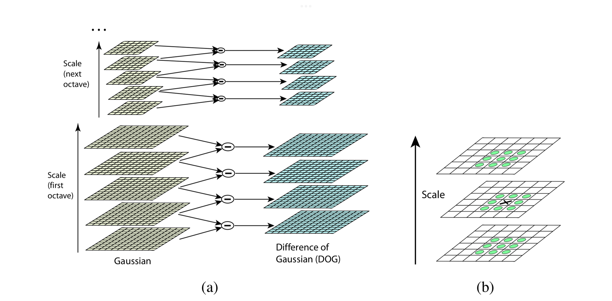
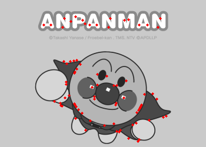

# HW01: Scale Invariant Feature Detection and Image Filtering
`difference of gaussian` 、 `biliteral filter`


## Part 1: Scale Invariant Feature Detection
Implement difference of Gaussain (DoG).
<div align="center">
  
</div>
 

|octaves | Gaussian Images each ocatves|
|:--:|:--:|
|`octave1`| |
|`octave2`| |

```
usage: main.py [-h] [--threshold THRESHOLD]
               [--image_path IMAGE_PATH] [--save SAVE]

main function of Difference of Gaussian

options:
  -h, --help            show this help message and exit
  --threshold THRESHOLD
                        threshold value for feature selection
  --image_path IMAGE_PATH
                        path to input image
  --save SAVE           save the image with keypoints plotting
```

```bash
python main.py
```

<div align="center" align-items="flex-start">
  
  
</div>

## Part 2: Image Filtering

