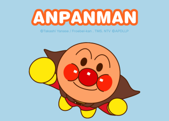

# HW01: Scale Invariant Feature Detection and Image Filtering
`difference of gaussian` 、 `joint biliteral filter`

## Part 1: Scale Invariant Feature Detection
Implement the difference of Gaussain (`DoG`) to process the scale invariant feature detection. 

  

 
### Result

 In this part, two octaves are applying with five gaussian images and four difference of gaussian images querying. 

|octaves | gaussian images of each ocatve|
|:--:|:--:|
|`octave1`| |
|`octave2`| |

scale invariant feature detection: 

  
  

## Part 2: Image Filtering

